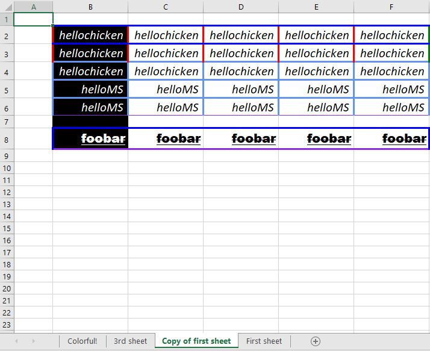

<h2>About</h2>
A fluent API use to quickly build an Excel file.

<h3>Prerequisite namespace</h3>

```csharp
using System.Drawing;
```

<h3>Methods for sheet operations.</h3>
<table>
<tr><td>vExcel.vWorksheet PushNewSheet(System.String)</td><td>Creates and returns the created sheet</td></tr>
<tr><td>vExcel.vWorksheet PopSheetByName(System.String)</td><td>Removes and returns the last created sheet</td></tr>
<tr><td>vExcel.vWorksheet GetSheetByName(System.String)</td><td>SELF-EXPLANATORY</td></tr>
<tr><td>vExcel.vWorksheet RenameSheetByName(System.String, System.String)"</td><td>SELF-EXPLANATORY</td></tr>
<tr><td>vExcel.vWorksheet CopySheetByName(System.String, System.String)"</td><td>Copies and returns the copy sheet</td></tr>
<tr><td>Void SaveOverride(System.String)</td><td>Save Excel file</td></tr>
<tr><td>Void Close()</td><td>Use this or Using keyword to dispose resources</td></tr>
<tr><td>Static Void OpenInExcel(System.String)</td><td>Opens an excel file in Microsoft Excel as a separate process.</td></tr>
</table>

<h3>Methods for cell or range of cells manipulation.</h3>
<table>
<tr><td>vExcel.vWorksheet SelectCells(Int32, Int32, Int32, Int32)"</td><td>Coordinate of top-left and bottom-right cell</td></tr>
<tr><td>vExcel.vWorksheet SelectCell(Int32, Int32)"</td><td>SELF-EXPLANATORY</td></tr>
<tr><td>vExcel.vWorksheet SetValue(System.String)</td><td>SELF-EXPLANATORY</td></tr>
<tr><td>vExcel.vWorksheet ReplaceValue(System.String, System.String)"</td><td>SELF-EXPLANATORY</td></tr>
<tr><td>vExcel.vWorksheet ReplaceValueContaining(System.String, System.String)"</td><td>Replace values from matching substring</td></tr>
<tr><td>vExcel.vWorksheet ClearValue()</td><td>SELF-EXPLANATORY</td></tr>
<tr><td>vExcel.vWorksheet SetFontSize(Int32)</td><td>SELF-EXPLANATORY</td></tr>
<tr><td>vExcel.vWorksheet SetFontColor(System.Drawing.Color)</td><td>SELF-EXPLANATORY</td></tr>
<tr><td>vExcel.vWorksheet SetFontFamily(System.String)</td><td>SELF-EXPLANATORY</td></tr>
<tr><td>vExcel.vWorksheet SetFontBold(Boolean)</td><td>SELF-EXPLANATORY</td></tr>
<tr><td>vExcel.vWorksheet SetFontItalic(Boolean)</td><td>SELF-EXPLANATORY</td></tr>
<tr><td>vExcel.vWorksheet SetFontUnderline(Boolean)</td><td>SELF-EXPLANATORY</td></tr>
<tr><td>vExcel.vWorksheet SetFontStrikethrough(Boolean)</td><td>SELF-EXPLANATORY</td></tr>
<tr><td>vExcel.vWorksheet SetFontHorizontalCenter()</td><td>SELF-EXPLANATORY</td></tr>
<tr><td>vExcel.vWorksheet SetFontHorizontalLeft()</td><td>SELF-EXPLANATORY</td></tr>
<tr><td>vExcel.vWorksheet SetFontHorizontalRight()</td><td>SELF-EXPLANATORY</td></tr>
<tr><td>vExcel.vWorksheet SetFontVerticalCenter()</td><td>SELF-EXPLANATORY</td></tr>
<tr><td>vExcel.vWorksheet SetFontVerticalBottom()</td><td>SELF-EXPLANATORY</td></tr>
<tr><td>vExcel.vWorksheet SetFontVerticalTop()</td><td>SELF-EXPLANATORY</td></tr>
<tr><td>vExcel.vWorksheet AutoSizeColumns()</td><td>SELF-EXPLANATORY</td></tr>
<tr><td>vExcel.vWorksheet AutoSizeColumnsRelative()</td><td>Autosize entire column based on the current selected cell.</td></tr>
<tr><td>vExcel.vWorksheet SetBorderWeights(Double, Double, Double, Double)"</td><td>"Top, right, bottom, left</td></tr>
<tr><td>vExcel.vWorksheet SetBorderWeightsEach(Double, Double, Double, Double)"</td><td>Applies per cell</td></tr>
<tr><td>vExcel.vWorksheet SetBorderWeightEach(Double)</td><td>SELF-EXPLANATORY</td></tr>
<tr><td>vExcel.vWorksheet SetBorderBottom(Double, System.Drawing.Color)"</td><td>SELF-EXPLANATORY</td></tr>
<tr><td>vExcel.vWorksheet SetBorderWeight(Double)</td><td>SELF-EXPLANATORY</td></tr>
<tr><td>vExcel.vWorksheet SetBorderColors(System.Drawing.Color, System.Drawing.Color, System.Drawing.Color, System.Drawing.Color)"</td><td>"Top, right, bottom, left</td></tr>
<tr><td>vExcel.vWorksheet SetBorderColorsEach(System.Drawing.Color, System.Drawing.Color, System.Drawing.Color, System.Drawing.Color)"</td><td>Applies per cell</td></tr>
<tr><td>vExcel.vWorksheet SetBorderColorEach(System.Drawing.Color)</td><td>SELF-EXPLANATORY</td></tr>
<tr><td>vExcel.vWorksheet SetDefaultBorder()</td><td>SELF-EXPLANATORY</td></tr>
<tr><td>vExcel.vWorksheet SetBorderColor(System.Drawing.Color)</td><td>SELF-EXPLANATORY</td></tr>
<tr><td>vExcel.vWorksheet SetComment(System.String)</td><td>SELF-EXPLANATORY</td></tr>
<tr><td>vExcel.vWorksheet SetBackgroundColor(System.Drawing.Color)</td><td>SELF-EXPLANATORY</td></tr>
</table>

<h3>Sample code usage</h3>

```csharp
static void Main(string[] args)
        {
            var filepath = Directory.GetCurrentDirectory() + "\\test.xlsx";          
            using (var excel = vExcel.vExcel.Factory())
            {
                excel.PushNewSheet("First sheet")
                    .SelectCells(2, 2, 6, 6)
                    .SetValue("helloworld")
                    .SelectCells(2,5,6,6)
                    .SetValue("helloMS")
                    .SelectCells(2, 2, 6, 6)
                    .SetFontSize(16)
                    .SetBorderColors(Color.Blue, Color.Green, Color.Orange, Color.Red)
                    .SetBorderWeights(4d, 3d, 4d, 3d)
                    .ReplaceValue("helloworld", "hellocat")
                    .ReplaceValueContaining("cat", "hellochicken")
                    .SetFontItalic(true)
                    .AutoSizeColumns()

                    .SelectCells(2, 8, 6, 8)
                    .SetValue("foobar")
                    .SetFontSize(16)
                    .SetFontFamily("Arial Black")
                    .SetFontBold(true)
                    .SetFontStrikethrough(true)
                    .SetFontUnderline(true)
                    .SetFontHorizontalRight()
                    .SetBorderColor(Color.Blue)
                    .SetBorderWeights(4d, 4d, 4d, 4d)
                    .SetBorderBottom(4d, Color.BlueViolet)

                    .SelectCells(2, 2, 2, 8)
                    .SetBackgroundColor(Color.Black)
                    .SetFontColor(Color.White);

                //Copies and returns the copy sheet
                excel.CopySheetByName("First sheet", "Copy of first sheet")
                    .SelectCells(2, 2, 6, 6)
                    .SetBorderWeightEach(4d)
                    .SetBorderColorsEach(Color.Blue, Color.Green, Color.Orange, Color.Red)
                    .SelectCells(2, 4, 6, 6)
                    .SetBorderColorEach(Color.CornflowerBlue)
                    .SetBorderBottom(2d, Color.BlueViolet);

                excel.PushNewSheet("Second sheet");

                excel.PushNewSheet("Third sheet");

                //Removes "Second sheet" returns the last created sheet, which is "Third Sheet"
                excel.PopSheetByName("Second sheet")
                    .SelectCells(2, 5, 5, 5)
                    .SetValue("3nd sheet!!!")
                    .SetFontColor(Color.GreenYellow)
                    .SetBorderColor(Color.Blue)
                    .SetBackgroundColor(Color.Magenta)
                    .SetBorderWeight(4d);

                excel.RenameSheetByName("Third sheet", "3rd sheet")
                    .SelectCells(2, 2, 4, 4)
                    .SetValue("3nd")
                    .SetFontBold(true)
                    .AutoSizeColumnsRelative()
                    .SelectCell(1,1)
                    .SetValue("Notice it is autosize relative to the '3rd' cells")
                    .AutoSizeColumnsRelative();

                //Creates a colorful sheet
                var colorfulSheet = excel.PushNewSheet("Colorful!");
                var colors = new List<Color>()
                {
                    Color.Red,
                    Color.Aquamarine,
                    Color.Blue,
                    Color.Brown,
                    Color.Green,
                    Color.Orange,
                    Color.Magenta,
                    Color.DodgerBlue
                };
                var families = new List<String>()
                {
                    "Algerian", "Arial Black", "Arial Rounded MT Bold",
                    "Broadway", "Cooper Black", "Lucida Handwriting", "Magneto",
                    "Viner Hand ITC", "Vladimir Script"

                };
                var ran = new Random();
                var getColor = new Func<Color>(() => colors[ran.Next(0, colors.Count)]);
                var getFamily = new Func<String>(() => families[ran.Next(0, families.Count)]);
                for (int i = 1; i < 12; i++)
                {
                    for (int j = 1; j < 12; j++)
                    {
                        colorfulSheet
                            .SelectCell(i, j)
                            .SetValue("COLORZ!")
                            .SetFontSize(ran.Next(9, 18))
                            .SetFontBold(ran.Next(0,2) == 1)
                            .SetFontItalic(ran.Next(0, 2) == 1)
                            .SetFontStrikethrough(ran.Next(0, 2) == 1)
                            .SetFontUnderline(ran.Next(0, 2) == 1)
                            .SetFontColor(getColor())
                            .SetFontFamily(getFamily())
                            .SetBorderColors(getColor(), getColor(), getColor(), getColor())
                            .SetBorderWeight(4d)
                            .SetBackgroundColor(getColor())
                            .AutoSizeColumns();
                    }
                }
                //hollow out around the center
                colorfulSheet
                    .SelectCells(3, 3, 9, 10)
                    .SetBackgroundColor(Color.Transparent)
                    .ClearValue()
                    .SetDefaultBorder();

                //Saves the excel file, will override if already exist
                excel.SaveOverride(filepath);
            }

            //Opens the xlsx file in Excel
            vExcel.vExcel.OpenInExcel(filepath);
        }
    }
```

<h3>Result from sample Code</h3>




